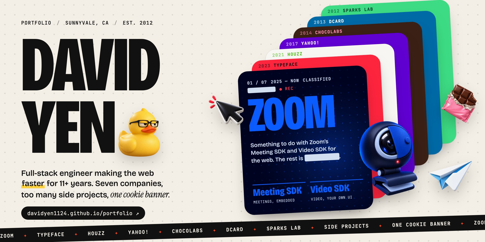

<a href="https://davidyen1124.github.io/portfolio/"></a>

# David Yen · portfolio

[](https://github.com/davidyen1124/portfolio/actions/workflows/deploy.yml)

**Live: [davidyen1124.github.io/portfolio](https://davidyen1124.github.io/portfolio/)**

A scroll-driven portfolio. One screen per company, newest first, each in that company's colours and stacked like posters: every screen slides up over the last one while the year in the header counts back to 2012. Then a VHS fast-forward brings you back to now for the side projects.

The old version was a walk-around 3D museum. It is in the git history, where it can think about what it did.

## What's on the page

| Screen | Palette | Toys |
|---|---|---|
| Hero: who is this | cream, ink, tomato | laptop, bubble tea, keycap, a rubber duck with opinions |
| Zoom (2025–now) | Zoom blue on midnight navy | a webcam with its shutter half-closed, a wall of camera-off tiles, a muted mic, a sealed folder. The name starts under a CLASSIFIED bar and gets declassified as you scroll; the redactions reveal nothing useful on hover |
| Typeface (2023–2025) | Typeface red + black | cursor, a box in a C-clamp (the bundle), canvas, rosette |
| Houzz (2021) | Houzz green on linen | sofa, arc lamp, monstera, tiny house |
| Yahoo (2017) | Yahoo purple | exclamation mark, bar chart, hourglass, anomaly under a magnifier |
| CHOCOLABS (2014) | chocolate + candy pink | chocolate bar, chocolate vinyl, headphones, test tube |
| Dcard (2013) | Dcard blues | profile card, push bell, midnight clock, paper plane |
| Sparks Lab (2012) | Android green | phone, trophy, guzheng, lightning |
| Fast-forward: 2012 → 2026 | VHS black | tracking lines, a timecode that spins forward back to now |
| Side projects | black | a horizontal track of cards, star counts fetched live from GitHub |
| The end | cream | contact, awards, education |

And the humour department:

- **Fake notifications** from apps you don't have (a recruiter who can't spell "David", Yahoo Mail from 2009, Webpack in therapy). The third one offers Do Not Disturb. Mom gets through anyway.
- **A cookie banner** for a site with no cookies. Strictly necessary cookies can't be unticked (nice try). Accepting makes it rain cookies.
- **DavidBot™**, an "AI assistant" made of regular expressions with low self-esteem.

## Stack

TypeScript (strict) + Vite, GSAP ScrollTrigger for the scroll choreography, Lenis for smooth scrolling. No framework. Content lives in [`src/content.ts`](src/content.ts), and the facts come from [`public/resume.pdf`](public/resume.pdf).

```bash
npm install
npm run dev        # http://localhost:5173/portfolio/
npm run build      # type-check + production build into dist/
```

Pushing to `main` deploys to GitHub Pages via [`.github/workflows/deploy.yml`](.github/workflows/deploy.yml).

## The art

Every illustration was generated with **Codex CLI**'s built-in `image_gen` tool: 44 isolated "designer vinyl toy" renders on transparent backgrounds, so they can float as parallax layers over any brand colour. The briefs and the shared style prompt are in [`art/manifest.mjs`](art/manifest.mjs).

The cover at the top of this README is built from the same pieces (fonts, toys and the company colours in `src/content.ts`) in [`art/cover/index.html`](art/cover/index.html), and rendered at 2560×1280 with `node scripts/cover.mjs` while the dev server is running.

```bash
npm run art:gen -- hero-duck     # one codex exec per image → art/raw/<name>.png (git-ignored)
npm run art:process              # trim + WebP at two sizes → public/img, real widths → src/art-sizes.json
```

## QA

```bash
npm run dev -- --port 5199 &
npm run qa -- --vp desktop,laptop,wide,tablet,mobile,small,reduced,landscape
node scripts/qa-ui.mjs
node scripts/qa-swipe.mjs http://localhost:5199/portfolio/
```

`scripts/qa.mjs` walks the whole page in 24px steps on each viewport. At every step it checks for horizontal overflow, text clipped off-screen, toys sitting on top of readable copy, copy blocks colliding, the ticker tape running over stats, console errors and broken images. It also saves screenshots and contact sheets to `qa-shots/`. `?qa` in the URL turns off smoothing so every frame is exactly where the test scrolled.

`scripts/qa-ui.mjs` clicks through the cookie banner, notifications, Do Not Disturb and a DavidBot conversation on desktop and mobile. `scripts/qa-swipe.mjs` does real touch swipes on an emulated iPhone, with and without the chat open.

## License

MIT
